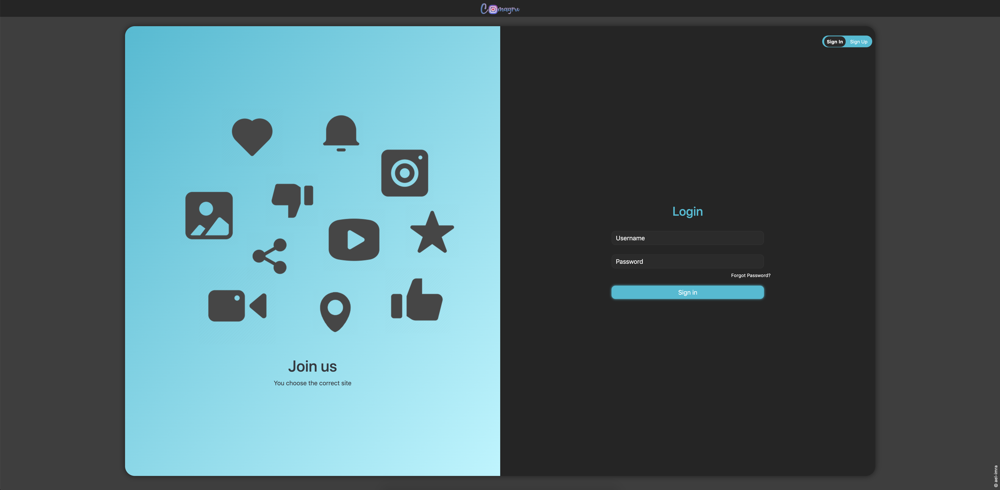
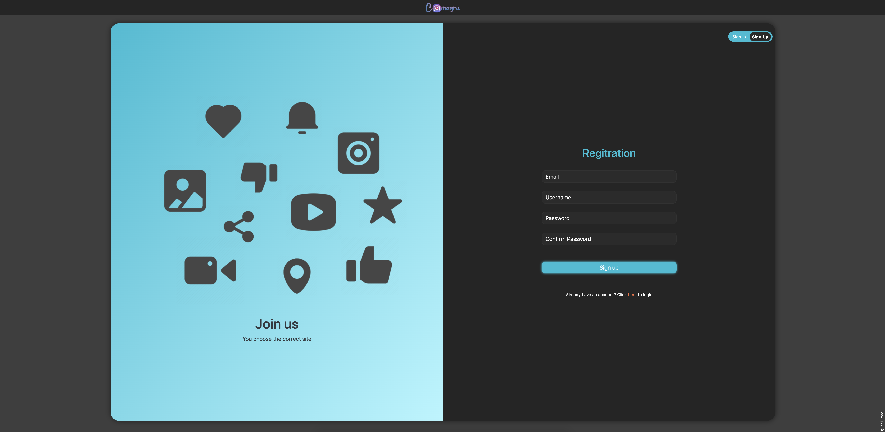
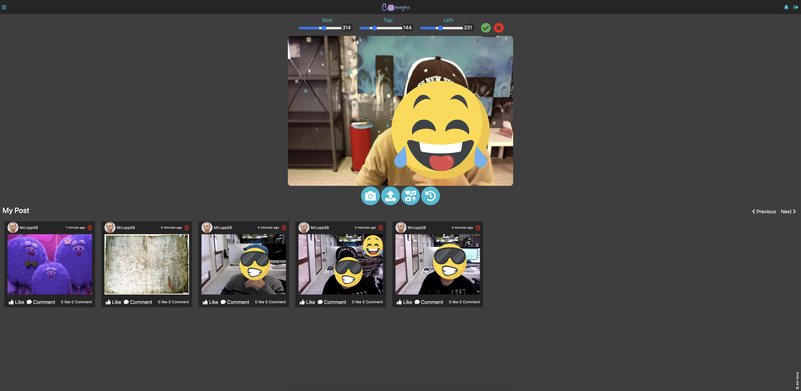
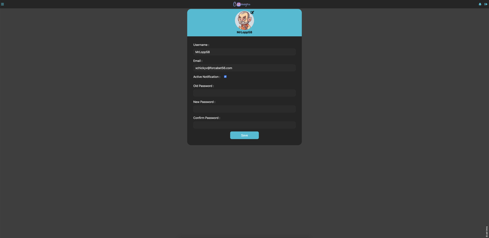

# Camagru    

Creating a small instagram using PHP and MySQL

## Intro

Objective of this project is to create a complete website like instagram,sharing pictures with other users

### Stack

-   PHP
-   HTML/CSS/JS
-   BOOTSTRAP
-   MySQL
-   DOCKER

### Features

My Camagru project handles:

-   DB creation script
-   User creation and authentication using session
-   Pictures upload and default profile picture
-   Complete user profile page with gender, bio, location, interests details...
-   User profile edition (password, details)
-   Capture Images using camera
-   Manipulate image adding to it emoji with possibility to move emoji around image
-   Email notifications for authentication and password reset (with auth key)
-   Profile, pictures deletion and user DB cleanup
-   Responsive design from mobile to desktop
-   Password hashing
-   HTML/Javascript/SQL injections prevention

## Installation

#### Docker installation

    [Linux installation](https://docs.docker.com/engine/install/ubuntu/)
    [Mac installation](https://docs.docker.com/docker-for-mac/install/)
    [Windows installation](https://docs.docker.com/docker-for-windows/install/)

#### Configuration file

-   config/msmtprc file contain mail sender info(you could change this)

```bash
defaults
auth    on
tls     on
logfile /var/log/msmtp.log

dsn_notify off
dsn_return off

# GMAIL
account     gmail
host        smtp.gmail.com
port        587
from        <email>
user        <email>
password    <password>
protocol smtp

account default : gmail

```

#### Docker images installation

```bash
#inside folder of camagru
docker-compose up -d #-d to run it on background
```

after images installed you're good to start website using your ip address,
because we're using http instead of https camera won't work to fix this issue
browse chrome://flags/#unsafely-treat-insecure-origin-as-secure
enable it and add your ip address to the field and relaunch the browser

## Screenshots

Home</br>
</br>
SignIn</br>
</br>
SignUp</br>
</br>
Snap</br>
</br>
Profile</br>
</br>
Menu</br>
</br>
